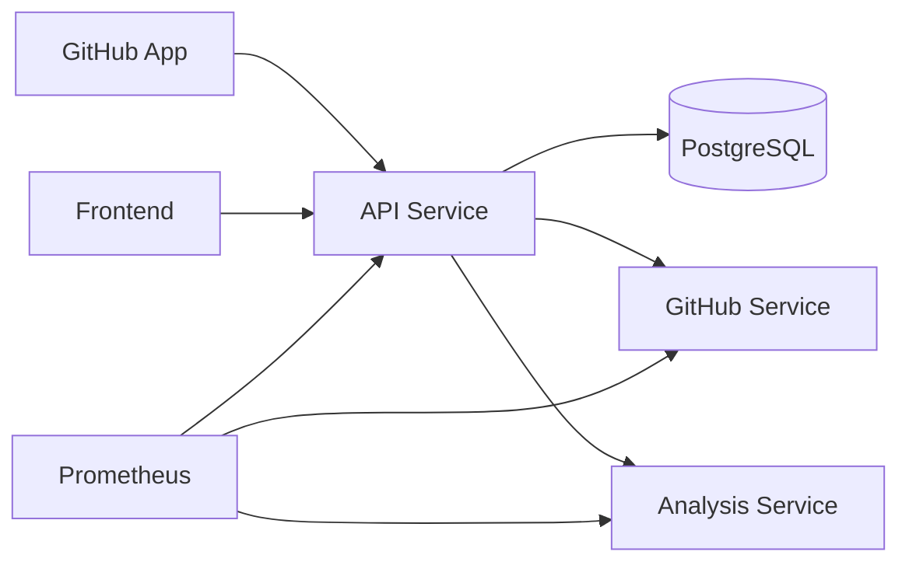

# Architecture Overview

Mitig8it is a multi-service GitHub App system. The active runtime path is:

The repository still uses the `codesentry` namespace in database names, metrics, package metadata, and Cloud Run resources.

## Services

| Service | Path | Local port | Responsibility |
|---|---|---:|---|
| Frontend | `frontend/` | `5173` | React dashboard, onboarding, repositories, PR reports, findings, suppressions, account/settings pages. |
| API service | `services/api-service/` | `3000` | Auth/session, GitHub OAuth, webhook ingest, PostgreSQL persistence, analysis orchestration, dashboard REST APIs. |
| GitHub service | `services/github-service/` | `3002` inside Compose | GitHub App auth, PR changed-file fetch, summary comments, inline comments, check runs, optional notifications. |
| Analysis service | `services/analysis-service/` | `8001` inside Compose | Changed-file security analysis using regex rules, dependency checks, OpenGrep, remediation patches, optional LLM triage. |
| Postgres | Compose service | `5432` | Canonical relational data store. |
| Prometheus | Compose service | `9090` | Local scrape target for service metrics. |

## Control Plane

`services/api-service` owns the main application state and user-facing API:

- `GET /health` validates API and Postgres health.
- `/auth/*` handles GitHub OAuth, session cookies, logout, and current-user lookup.
- `POST /webhooks/github` verifies GitHub signatures and ingests installation/repository/PR events.
- `/api/installations/*` syncs GitHub App installations and repositories.
- `/api/repositories/*` lists repositories, connects/disconnects them, requeues profiling, and toggles baseline mode.
- `/api/reports/*` exposes analysis reports and summary counts.
- `/api/findings/*`, `/api/pull-requests/:id/findings`, and `/api/suppressions/*` expose finding lifecycle and suppression APIs.
- `/api/webhooks/events` surfaces recent PR/webhook-derived events for the dashboard.
- `GET /metrics` exposes Prometheus metrics.

The API runs schema bootstrap locally on startup and production migrations through the Cloud Run deploy workflow before deployment.

## GitHub Integration Plane

`services/github-service` is the GitHub API adapter. It exposes:

- `GET /health`
- `GET /health/github-app`
- `GET /metrics`
- `POST /webhooks/github` for direct webhook testing
- `/internal/*` endpoints used by the API service for changed files, comments, and check runs

Internal routes are protected with `GITHUB_SERVICE_INTERNAL_SECRET`. The service accepts `WEBHOOK_SECRET`; local Compose maps this from the root `GITHUB_WEBHOOK_SECRET`.

## Analysis Plane

`services/analysis-service` exposes:

- `GET /health`
- `GET /metrics`
- `POST /analyze/pr`
- `POST /analyze/pr/tier1`
- `POST /analyze/pr/tier2`
- `POST /analyze/pr/tier3`

Analysis requests and metrics require `x-internal-secret`. The expected value is `ANALYSIS_SERVICE_INTERNAL_SECRET` when set, otherwise `GITHUB_SERVICE_INTERNAL_SECRET`.

The combined `/analyze/pr` route:

1. Filters non-runtime paths such as tests and OpenGrep rule files.
2. Runs Tier 1 regex and dependency checks.
3. Runs Tier 2 OpenGrep rules from `src/opengrep_rules/`.
4. Runs Tier 3 LLM triage when configured.
5. Clusters findings and returns normalized finding objects.

OpenGrep and LLM failures are non-blocking in the combined path.

## Data Model

PostgreSQL is the source of truth. Core tables include:

- `installations`
- `users`
- `user_installations`
- `repositories`
- `repository_access`
- `pull_requests`
- `analysis_runs`
- `findings`
- `suppressions`
- `audit_logs`
- `webhook_deliveries`

Key behaviors:

- Webhook delivery idempotency uses `webhook_deliveries.delivery_id`.
- Repository authorization is mediated through `repository_access`.
- Findings are fingerprinted for dedupe and fixed-state transitions.
- Suppressions can target a finding or fingerprint and write audit logs.
- Baseline mode is tracked on repositories and findings.

## Security Boundaries

- GitHub webhooks are HMAC-verified with `GITHUB_WEBHOOK_SECRET`.
- Dashboard auth uses an `HttpOnly` `__session` cookie signed with `JWT_SECRET`.
- Mutating dashboard requests require `X-CSRF-Protection: 1`.
- API CORS allows configured frontend origins, CodeSentry Firebase hosting URLs, and Mitig8it production domains.
- API-to-GitHub-service and API-to-analysis-service calls use shared internal secrets.
- Production metrics endpoints require `x-internal-secret`.
- GitHub OAuth tokens are encrypted with `ENCRYPTION_KEY`.

## Local Infrastructure

Primary local infrastructure is [docker-compose.yml](../../docker-compose.yml):

- `postgres:15-alpine`
- Backend service containers built from local Dockerfiles
- Frontend Vite container
- `prom/prometheus:v2.54.1`
- Named volumes for Postgres and Prometheus data
- One bridge network: `mitig8it-net`

## Production Infrastructure

Production is deployed by GitHub Actions:

- `frontend` -> Firebase Hosting
- `api-service` -> Cloud Run service `codesentry-api`
- `github-service` -> Cloud Run service `codesentry-github`
- `analysis-service` -> Cloud Run service `codesentry-analysis`
- Container images -> Google Artifact Registry
- Runtime secrets -> GCP Secret Manager
- Database -> managed PostgreSQL connection exposed through `codesentry-database-url`

See [cloud-run-firebase.md](../deployment/cloud-run-firebase.md).
